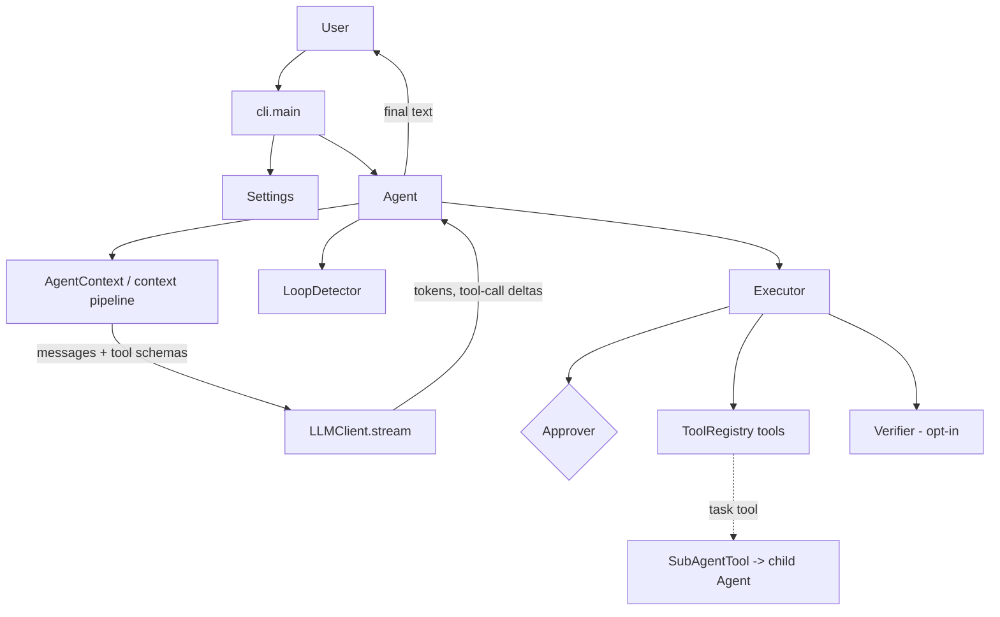

# Reflex Code

> An autonomous coding agent that lives in your terminal.

> **v0.1.0 — First public release**

Reflex Code is an experimental AI coding agent focused on context engineering, reliable tool execution, evaluation, and agentic workflows. Give it a task in natural language and it reads your code, edits files, runs commands, and verifies results — asking for your approval before consequential actions.

## Demo

<!-- Add your demo video/GIF here -->

---

## Why Reflex Code?

Unlike traditional chat-based agents that continuously append conversation history, Reflex Code rebuilds its prompt every iteration from a compact, state-driven context pipeline. It combines context engineering, prompt orchestration, tool execution, verification, evaluation, and bounded sub-agent delegation in a single extensible harness.

---

## Quickstart

Prerequisites: **Python 3.11+** and [uv](https://docs.astral.sh/uv/) (or plain pip), plus an LLM provider API key (default configuration uses OpenRouter).

### 1. Install

```bash
git clone https://github.com/K4rthik14/terminal-agent.git
cd terminal-agent
uv sync
```

Prefer plain pip?

```bash
python3 -m venv .venv
source .venv/bin/activate
pip install -e .
```

Verify:

```bash
reflex --help        # or: uv run reflex --help
```

If `reflex` is not found, activate the virtualenv (`source .venv/bin/activate`) or run through `uv`.

### 2. Configure

Reflex Code needs one API key:

```bash
export AGENT_API_KEY="<your-api-key>"
```

`OPENROUTER_API_KEY` is also accepted. Alternatively copy `.env.example` to `.env` in your project root and set the key there.

The model works out of the box (`poolside/laguna-s-2.1:free` via OpenRouter). To use another model:

```bash
export AGENT_MODEL="<model-name>"    # or pass --model on any command
```

Optional: set `AGENT_FIRECRAWL_API_KEY` to enable web search/fetch.

### 3. Run

Reflex Code operates on your **current working directory** — run it from your project root. That directory is shown in the startup panel, provided to the model as environment context, and used as the root for all tools.

```bash
reflex
```

Interactive session:

- Type tasks at the `>` prompt.
- `/plan` toggles plan mode (read-only planning; write tools disabled).
- `Ctrl+C` interrupts, `Ctrl+D` exits.
- In the default approval mode, Reflex asks before running commands or modifying files.

One-shot task:

```bash
reflex --prompt "explain what src/parser.py does in three sentences"
```

### Configuration reference

All settings load from environment variables and/or a local `.env`; CLI flags override both.

| Variable | Required | Purpose |
| --- | --- | --- |
| `AGENT_API_KEY` | Yes | LLM provider API key (`OPENROUTER_API_KEY` accepted) |
| `AGENT_MODEL` | No | Model name; built-in default if unset (`--model` overrides) |
| `AGENT_FIRECRAWL_API_KEY` | No | Enables web search/fetch tools |
| `AGENT_APPROVAL_MODE` | No | `auto` (default), `always`, or `never` |
| `AGENT_MAX_TOKENS` | No | Max tokens per LLM response |
| `AGENT_LLM_TIMEOUT_SECONDS` | No | Per-request ceiling in seconds, including streaming (default 120) |
| `AGENT_VERIFICATION_COMMAND` | No | Shell command run after each candidate final reply; failure triggers a bounded repair iteration (empty = disabled) |
| `AGENT_VERIFICATION_TIMEOUT_SECONDS` | No | Timeout for the verification command (default 30) |
| `AGENT_RLM_ENABLED` | No | Opt-in read-only pre-execution reasoning phase for one-shot prompts (default off) |

See `.env.example` for the annotated list.

---

## Usage

| Command / flag | Effect |
| --- | --- |
| `reflex` | Interactive session |
| `reflex --prompt "TEXT"` | Run one task, then exit |
| `reflex --plan` | Start in plan mode (no writes) |
| `reflex --no-approval` | Skip approval prompts (use with care) |
| `reflex --model MODEL` | Override the model for this session |

**Approval modes** (`AGENT_APPROVAL_MODE`): `auto` (default) prompts before anything that can modify your system; `always` prompts for every tool call; `never` runs everything without asking. Prompts are deny-by-default (`[y/N]`); Ctrl+C or EOF during a prompt denies.

**Plan mode** (`--plan`, or `/plan` in-session): read-only planning. Write tools are blocked at the executor level, including delegation.

---

## What it can do

Shipped and reachable in v0.1.0:

- Streaming LLM responses with function calling
- File read/write/edit and shell execution
- Human approval before consequential actions (deny-by-default)
- Plan mode for read-only planning
- State-driven context pipeline: prompt rebuilt every iteration from goal, file hints, relevant tools, and a bounded conversation tail
- Loop detection and execution budgets (max iterations, max tool calls, wall clock)
- Bounded transient-error retries, mid-stream failure handling, per-request timeout
- Web search/fetch (Firecrawl key required)
- Evaluation harness CLI with a 15-task internal suite
- Custom terminal UI with streaming output and startup panel

**Experimental (opt-in):**

- Deterministic verification loop (`AGENT_VERIFICATION_COMMAND`): failed checks trigger a bounded repair iteration
- RLM-based pre-execution reasoning (`AGENT_RLM_ENABLED`): a bounded read-only inspection phase for one-shot prompts; no measured quality improvement yet

**Sub-agent delegation:** Reflex can delegate focused tasks to a child agent through the `task` tool.

- Child agents receive isolated context
- Child agents have their own tool registry
- Results are returned to the parent agent
- Delegation depth is bounded to prevent recursive runaway execution

The `MultiAgentCoordinator` (Planner / Executor / Reviewer / Researcher) exists as an experimental orchestration component but is **not wired into the v0.1 runtime**.

---

## Architecture

Actual v0.1 runtime path:



Deep dives:

- [`docs/ARCHITECTURE.md`](docs/ARCHITECTURE.md) — full narrative: context pipeline, executor, reliability, delegation, RLM, what's integrated vs standalone
- [`docs/v1.0-audit.md`](docs/v1.0-audit.md) — engineering audit of v0.1.0 and the roadmap to v1.0
- [`docs/tools.md`](docs/tools.md) — tool reference

---

## Evaluation

The repository ships an internal evaluation harness:

```bash
uv run python -m evals.runner                      # run all 15 built-in tasks
uv run python -m evals.runner --no-approval        # non-interactive mode
```

Tasks live in `evals/tasks/*.json` (prompt + verification command each); each runs in an isolated temporary workspace, judged by exit code, recorded in `evals/results/results.json`.

Last recorded full run: **12/15 passed**. This is a small internal suite recorded before later v0.1 changes — treat it as a harness demonstration, not a benchmark claim. No external benchmark results are claimed.

---

## Current limitations

- Single provider client wired (OpenAI-compatible / OpenRouter); provider selection is fixed in v0.1
- Context selection is heuristic (keyword/path matching), not semantic retrieval
- RLM is experimental: opt-in, one-shot only, no demonstrated quality improvement yet
- `MultiAgentCoordinator` is implemented but not wired into the CLI runtime
- The internal evaluation suite is small (15 tasks); its last recorded run predates later code changes
- Terminal-Bench results are **not** claimed; none exist for Reflex
- Lint/type baselines are configured but not fully clean (ruff/mypy have known findings)
- Integration test coverage is minimal; tests are primarily unit-level

---

## Roadmap

Detailed rationale in [`docs/v1.0-audit.md`](docs/v1.0-audit.md):

- **v0.2** — measurement foundation: integration tests, richer metrics, RLM experiments, trajectory logging
- **v0.3** — evaluation + self-improvement: larger suites, richer judges, eval regression tracking, CI quality gates
- **v0.4** — orchestration: wire coordinator or evolve sub-agents (review passes, result sharing); structured planning lifecycle
- **v0.5** — capability depth: semantic context selection, persistent memory, verification by default
- **v1.0** — mature evaluated coding-agent system: independent benchmark run, stable extension APIs, PyPI distribution

---

## Development

Work on Reflex Code itself:

```bash
uv sync          # create/update the environment
uv run pytest    # run the test suite
```

Ruff and strict mypy are configured in `pyproject.toml`; their baselines currently contain known findings.

---

## Tech stack

Python · OpenAI-compatible APIs (OpenRouter) · Rich · Pydantic · Pytest

---

## Philosophy

Rather than treating an AI coding agent as a chatbot, this project treats it as a modular **AI Agent Harness**, where context construction, prompt orchestration, execution, evaluation, and orchestration are independent systems that work together to support reliable autonomous coding workflows.
