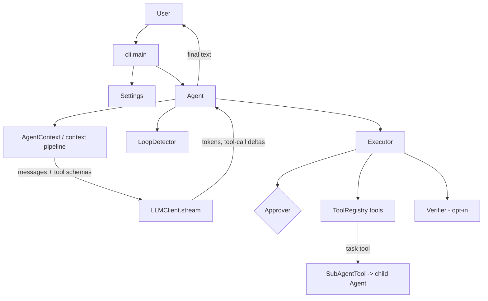

# Reflex Code

> An autonomous coding agent.

Reflex Code is an AI coding agent that lives in your terminal. Give it a task in natural language and it reads your code, edits files, runs commands, and verifies results — asking for your approval before consequential actions.

Unlike traditional chat-based agents that continuously append conversation history, Reflex Code rebuilds its prompt every iteration using a state-driven context pipeline, keeping context compact and interactions predictable.

## Status: v0.1.0

v0.1.0 is an early release: the core agent loop, tool calling, approval, plan mode, sub-agent delegation, and the evaluation harness are implemented and tested. Some components are experimental or opt-in (RLM, deterministic verification), and one orchestration component (`MultiAgentCoordinator`) exists as a library API but is **not** wired into the CLI runtime. See [docs/v1.0-audit.md](docs/v1.0-audit.md) for the full engineering audit.

---

# Quickstart

Install → Configure → Run → Give Reflex Code a task.

## Prerequisites

- **Python 3.11 or newer**
- **[uv](https://docs.astral.sh/uv/)** (recommended) *or* plain `pip`
- An **LLM provider API key** (the default configuration uses [OpenRouter](https://openrouter.ai))

## 1. Install

```bash
git clone https://github.com/K4rthik14/terminal-agent.git
cd terminal-agent
uv sync
```

This creates a virtual environment and installs the `reflex` command inside it.

Prefer plain pip?

```bash
python3 -m venv .venv
source .venv/bin/activate
pip install -e .
```

Verify the installation:

```bash
reflex --help
```

(With uv you can also run it without activating: `uv run reflex --help`.)

## 2. Configure

Reflex Code needs one API key. Export it as an environment variable:

```bash
export AGENT_API_KEY="<your-api-key>"
```

`OPENROUTER_API_KEY` is also accepted. Alternatively, put it in a `.env` file in your project root:

```bash
cp .env.example .env   # then set AGENT_API_KEY in the file
```

The model works out of the box (`poolside/laguna-s-2.1:free` via OpenRouter). To use a different model:

```bash
export AGENT_MODEL="<model-name>"    # or pass --model on any command
```

Optional: set `AGENT_FIRECRAWL_API_KEY` to enable the web search/fetch tools.

## 3. Run

```bash
reflex
```

This starts an interactive session:

- Type tasks at the `>` prompt.
- `/plan` toggles plan mode (read-only planning; write tools disabled).
- `Ctrl+C` interrupts, `Ctrl+D` exits.
- In the default approval mode, Reflex Code asks before running commands or modifying files.

## 4. Give Reflex Code a task

In an interactive session:

```text
> add input validation to scripts/upload.py and run its tests
```

Or run a single task non-interactively:

```bash
reflex --prompt "explain what src/parser.py does in three sentences"
```

Useful flags:

| Flag | Effect |
| --- | --- |
| `--model MODEL` | Override the model for this session |
| `--plan` | Start in plan mode (no writes) |
| `--no-approval` | Skip approval prompts (use with care) |
| `--prompt TEXT` | Run one task, then exit |

---

# Configuration reference

All settings load from environment variables and/or a local `.env` file (never committed). CLI flags override both.

| Variable | Required | Purpose |
| --- | --- | --- |
| `AGENT_API_KEY` | Yes | LLM provider API key (`OPENROUTER_API_KEY` accepted) |
| `AGENT_MODEL` | No | Model name; built-in default if unset (`--model` overrides) |
| `AGENT_FIRECRAWL_API_KEY` | No | Enables web search/fetch tools |
| `AGENT_APPROVAL_MODE` | No | `auto` (default), `always`, or `never` |
| `AGENT_MAX_TOKENS` | No | Max tokens per LLM response |
| `AGENT_LLM_TIMEOUT_SECONDS` | No | Per-request ceiling in seconds, including streaming (default 120) |
| `AGENT_VERIFICATION_COMMAND` | No | Shell command run after each candidate final reply; failure triggers a bounded repair iteration (empty = disabled, default) |
| `AGENT_VERIFICATION_TIMEOUT_SECONDS` | No | Timeout for the verification command (default 30) |
| `AGENT_RLM_ENABLED` | No | Opt-in read-only pre-execution reasoning phase for one-shot prompts (default off) |

See `.env.example` for the annotated list.

---

# Troubleshooting

**`No API key configured`**
Set `AGENT_API_KEY` in your environment or in a `.env` file in the directory where you run `reflex`. See step 2 above.

**`reflex: command not found`**
Your virtual environment is not active. Either activate it (`source .venv/bin/activate`) or run through uv (`uv run reflex ...`).

**Provider error: `<model>` is not a valid model ID**
The configured model name was rejected by the provider. Check the exact model identifier and set it via `--model` or `AGENT_MODEL`.

**Python version error during installation**
Reflex Code requires Python 3.11+. Check with `python3 --version`.

---

# Development

Work on Reflex Code itself:

```bash
uv sync          # create/update the environment
uv run pytest    # run the test suite
```

---

# Overview

This project is a modular terminal coding agent combining **context engineering**, **prompt orchestration**, **execution optimization**, **evaluation**, **sub-agent delegation**, and an (as-yet unwired) **multi-agent orchestration** library into a single extensible architecture.

## Working Directory

Reflex Code operates on your **current working directory**: that directory is shown in its startup panel, provided to the model as environment context, and used as the root for file tools and shell commands. Run it from your project's root. Configuration is also read from `./.env` there.

---

# Architecture

The actual v0.1 runtime path:



`MultiAgentCoordinator` (Planner / Executor / Reviewer / Researcher roles) exists in `orchestration/` as a library API with its own tests, but the CLI does not construct it — it is not part of the v0.1 runtime. Delegation in the product happens through the `task` sub-agent tool.

---

# Features

## Context Engineering

- ContextState
- Goal Extraction
- Relevant File Selection
- Relevant Tool Selection
- Conversation Selection
- Dynamic Prompt Construction (rebuilt every iteration)
- Prompt Orchestration
- Context Evaluation diagnostics

---

## Execution Optimization

- Loop Detection
- Tool Scheduling
- Human Approval (`always` / `auto` / `never`)
- Streaming Responses
- Function Calling
- Execution budgets: max iterations, max tool calls, wall-clock limit
- Bounded transient-error retries with per-request timeout

---

## Tooling

- File Read
- File Write
- File Edit
- Bash Execution
- Web Search (requires Firecrawl key)
- Web Fetch (requires Firecrawl key)
- Todo Management
- Sub-agent delegation via the `task` tool (depth-capped)

---

## Evaluation

- Evaluation harness CLI (`python -m evals.runner`)
- 15-task internal suite with verification commands
- Execution metrics and pass/fail reporting

---

## Sub-Agent Delegation

The parent agent can delegate focused work through the `task` tool. Each child runs with a fresh isolated context and its own tool registry, results return to the parent as an ordinary tool result, and nesting is capped at two levels so recursive delegation cannot become unbounded.

`orchestration.MultiAgentCoordinator` (Planner / Executor / Reviewer / Researcher) is implemented and unit-tested but **not wired into the runtime**; it is planned for a later release.

---

# Project Structure

```text
terminal-agent/
│
├── agent/
├── cli/
├── config/
├── context/
├── evals/
├── llm/
├── orchestration/
├── rlm/
├── tools/
├── utils/
├── docs/
└── tests/
```

---

# Design Principles

- Modular architecture
- Separation of concerns
- State-driven context engineering
- Token-efficient prompt construction
- Extensible orchestration
- Independent components
- Production-oriented design
- Evaluation-first development

---

# Current Capabilities

- Streaming LLM responses with function calling
- Plan mode (`--plan` or `/plan`): write tools disabled, read-only planning
- Human approval before consequential actions (deny-by-default)
- File operations and bash execution
- Web search/fetch (Firecrawl key required)
- State-driven context engineering pipeline
- Sub-agent delegation via the `task` tool (isolated context, depth cap)
- Opt-in deterministic verification loop (`AGENT_VERIFICATION_COMMAND`)
- Experimental opt-in RLM pre-execution reasoning for one-shot prompts
- Evaluation harness with a 15-task internal suite
- Bounded LLM retries, per-request timeout, execution budgets, loop detection

---

# Current Limitations

- The default model targets OpenRouter; provider selection is fixed to the OpenAI-compatible client in v0.1.
- Context selection is heuristic (keyword/path matching), not semantic retrieval.
- RLM is experimental: opt-in, one-shot only, no demonstrated quality improvement yet.
- `MultiAgentCoordinator` is not wired into the CLI runtime.
- The internal evaluation suite is small (15 tasks); the last recorded run is 12/15 passed and predates later code changes.
- Terminal-Bench results are **not** claimed; the repository contains only an oracle-agent harness-validation run.
- Lint/type baselines are configured but not fully clean (ruff/mypy have known findings).
- Integration test coverage is minimal; tests are primarily unit-level.

---

# Evaluation

The repository ships an internal evaluation harness:

```bash
uv run python -m evals.runner                      # run all 15 built-in tasks
uv run python -m evals.runner --no-approval        # non-interactive mode
```

Tasks live in `evals/tasks/*.json` (prompt + verification command each); the runner executes every task in an isolated temporary workspace, judges it by exit code, and writes `evals/results/results.json`.

Last recorded full run: **12/15 passed**. This is a small internal suite recorded before later v0.1 changes — treat it as a harness demonstration, not a benchmark claim.

---

# Future Work

- Recursive Language Models (RLM): deepen beyond the current experimental pre-execution brief
- Wiring `MultiAgentCoordinator` into the runtime (planner/reviewer workflows)
- Recursive Self Improvement (RSI)
- Persistent Memory
- Independent Terminal-Bench evaluation of Reflex itself
- Prompt Optimization
- Semantic context selection / retrieval
- Integration test suite and CI quality gates
- Self-Improving Harness

---

# Tech Stack

- Python
- OpenAI Compatible APIs
- OpenRouter
- Rich
- Pydantic
- Pytest

---

# Philosophy

Rather than treating an AI coding agent as a chatbot, this project treats it as a modular **AI Agent Harness**, where context construction, prompt orchestration, execution, evaluation, and orchestration are independent systems that work together to support reliable autonomous coding workflows.
