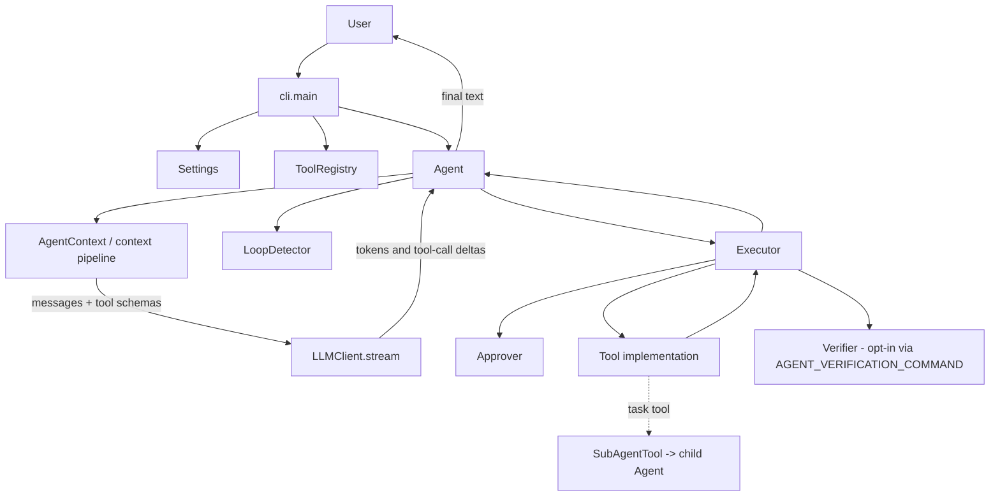

# Reflex Code Architecture (v0.1.0)

This document describes the implementation that exists today. It intentionally distinguishes code that is executed by the normal CLI runtime from components that are currently libraries, experiments, or test targets.

## 1. System boundary and runtime flow

The production entry point is `cli.main:main` (exposed as `reflex`, with legacy aliases `trace`, `nanocode`, and `agent` in `pyproject.toml`). It creates an OpenAI-compatible client (with a configurable per-request timeout), registers tools, creates one `Agent`, and then runs either a single prompt or the REPL.



For each `Agent.run(prompt, context)` call:

1. A new `AgentContext` is created if one was not supplied. It is initialized with plan mode and the configured message limit, and a user message is appended.
2. An `Approver`, `Executor`, `LoopDetector`, and `AgentRunMetrics` are created for this run.
3. Up to `Settings.max_iterations` iterations are performed.
4. The context selects a fresh `ContextSelection` from the current state and registry tools. The agent records selected message/tool sizes.
5. `LLMClient.stream(messages, tool_schemas)` is consumed. Text tokens are printed immediately. Tool-call deltas are accumulated by index into `ToolCall` objects.
6. If the provider finishes with `tool_calls`, the assistant tool-call message is added, each call is checked by the loop detector and otherwise dispatched by `Executor`. Tool results are appended to context, and the next iteration starts.
7. Any other finish reason is treated as the final answer. The assistant text is stored, metrics are finalized successfully, and the text is returned.
8. LLM errors return an error string and mark the run unsuccessful. Exhausting the iteration limit also marks the run unsuccessful and returns the last text.

The main loop executes multiple tool calls returned in one response sequentially. There is no separate asynchronous scheduler in this path.

## 2. Agent and LLM interaction

`llm.base.LLMClient` is a small provider-neutral abstract interface with one implemented contract: `stream(messages, tool_schemas) -> Iterator[StreamEvent]`. `llm.openai_client.OpenAIClient` adapts the OpenAI-compatible API and emits token, tool-call-delta, and done events.

The agent does not pass an entire provider response object through the system. It accumulates streamed text and tool-call fragments, parses JSON arguments, and converts results back into canonical conversation messages. The registry supplies provider-neutral function schemas.

The default CLI registers:

- `read_file`, `write_file`, and `edit_file`
- `bash`
- `todo_write`
- `web_search` and `web_fetch`
- `task`/sub-agent support through `SubAgentTool`

The actual availability sent to the model is filtered by the context tool selector, not necessarily the complete registry.

## 3. Context engineering pipeline

The context is state-driven rather than simply an ever-growing transcript. `AgentContext` owns the mutable session messages and flags. Before each model call it removes system messages from the conversation input, takes a bounded tail, extracts the latest user goal, and creates an immutable `ContextState`:

```text
AgentContext.messages + flags
        |
        v
ContextState(goal, conversation_tail, recent_tool_results,
            active_files, plan_mode, iteration)
        |
        v
ContextManager -> PromptOrchestrator
        |
        +-- GoalExtractor
        +-- RelevantFileSelector
        +-- ToolScheduler -> RelevantToolSelector
        +-- ConversationSelector
        +-- PromptBuilder
        |
        v
ContextSelection(messages, tool_schemas, goal, file hints, selected tools)
```

`ContextManager` is a compatibility facade. It normalizes the older `AgentState` shape into `ContextState` and delegates to `PromptOrchestrator`.

### ContextState and selectors

- `goal`: the latest non-empty user message in the bounded conversation. `GoalExtractor` currently performs lightweight extraction, not semantic planning.
- `conversation_tail`: already bounded by `MessageWindow`; `ConversationSelector` applies the configured maximum again.
- `recent_tool_results`: selected from the tail, but currently not independently used by the prompt builder.
- `active_files`: an extension point; `AgentContext` does not populate it today.
- `plan_mode` and `iteration`: included in the state and used for prompt/selection behavior.

`RelevantFileSelector` only extracts path-like strings from the goal and active-file hints. It does not open, inspect, or rank file contents. `RelevantToolSelector` uses keyword matching against the goal and conversation. It always adds `read_file` when it recognizes a category, uses a basic fallback set when it recognizes none, and falls back to all available tools if selection produces no registry match. This is deterministic and cheap, but intentionally heuristic.

## 4. PromptOrchestrator and PromptBuilder

`PromptOrchestrator.build()` runs selectors in a fixed order, schedules tools, selects conversation, and asks `PromptBuilder` to assemble the model input.

`PromptBuilder` creates a new leading system message on every iteration from:

1. The static prompt loaded by `ContextBuilder` (`context/prompts/system.md`).
2. `Current task: ...` when a goal exists.
3. Lightweight relevant-file hints.
4. A planning-mode instruction when enabled.

It then prepends that system message to the selected conversation. Thus the persisted `AgentContext` may contain an initial system message, but the normal per-iteration selection deliberately creates a fresh system message; the persisted initial system message is not reused as the selected system message.

`ContextEvaluator` can inspect a `ContextSelection` for message/tool counts, character budget utilization, system-message presence, goal presence, and warnings. It is diagnostic only and is not called by `Agent.run`; the agent records only raw context counts in `AgentRunMetrics`.

## 5. Tool scheduling and execution

`ToolRegistry` is the authoritative name-to-tool map and rejects duplicate registration. `ToolScheduler` delegates selection and schema conversion to `RelevantToolSelector`.

The runtime scheduling sequence is:

```text
LLM emits tool calls
  -> LoopDetector.observe(name, args)
  -> Executor.run(call)
       -> parse JSON
       -> registry lookup
       -> plan-mode write check
       -> approval policy
       -> tool.run(args)
  -> append ToolResult to AgentContext
```

`Executor` is deliberately defensive: malformed JSON, unknown tools, rejected calls, plan-mode write calls, and tool exceptions become `ToolResult` messages rather than crashing the loop. In plan mode, non-read-only tools are blocked; this is an execution guard, not a separate planning workflow.

Approval is interactive and controlled by `always`, `never`, or `auto` settings. In `auto`, only non-read-only tools require approval. There is no approval integration with the standalone verification layer.

## 6. Loop detection

`LoopDetector` canonicalizes arguments (including sorted JSON keys) and keeps a bounded history of invocations. With defaults (`max_repeats=2`, window size `8`), an identical call repeated immediately is blocked. The detector is consecutive-pattern based, not a general semantic or progress detector: different calls interrupt the count, and calls outside the bounded history are forgotten.

Blocked calls still produce a tool result for the model, increment `loop_detection_events`, and allow the run to continue. The detector is recreated for every top-level `Agent.run`.

## 7. Execution metrics

`AgentRunMetrics` is created per run and exposed as `Agent.last_run_metrics`. It records:

- success and monotonic elapsed execution time;
- attempted tool-call counts by name;
- loop-block events;
- per-iteration selected context message, character, and tool counts.

It does not record model latency, token usage, individual tool duration, approval decisions, failures by category, verification results, or final-answer quality. The renderer receives tool timing information for display, but those timings are not copied into `AgentRunMetrics`.

## 8. Verification layer

`verification.Verifier` is a deterministic standalone component. `verify_command()` runs a shell command with captured output and a timeout, passing only on exit code zero. It handles empty commands, timeouts, and `OSError`; `verify_test()` is the same check labeled as a test.

Since the v0.1 hardening pass, the verifier **is** wired into the runtime when configured: setting `AGENT_VERIFICATION_COMMAND` makes `build_agent` construct a `Verifier`, and `Agent.run` executes that command after every candidate final reply. A failed check appends a repair prompt to the context and continues the loop (bounded by `max_iterations`); a pass (or no configured command) completes the run normally. With the default empty command, no verifier is constructed and behavior is unchanged.

## 8b. LLM reliability

- **Transient retries**: request-time transport failures classified by message markers (`connection reset`, `sslerror`, `timeout`, `timed out`, ...) are retried up to `MAX_LLM_RETRIES` (2) with backoff. Permanent provider errors (e.g. HTTP 400/401) are never retried.
- **Streaming failures**: stream iteration happens inside the same error boundary as request creation in `OpenAIClient.stream()`, so mid-stream transport failures are normalized to `LLMError` and enter the same transient path.
- **Per-attempt reset**: on retry, the agent discards partially streamed tokens and tool-call fragments so an aborted attempt cannot corrupt the retried response.
- **Timeout**: `OpenAIClient` passes `AGENT_LLM_TIMEOUT_SECONDS` (default 120s) to the SDK, bounding connection, time-to-first-byte, and read gaps while streaming. Timeout errors match the transient markers and are retried.

## 8c. Sub-agent delegation

The `task` tool (`tools/sub_agent.py`) spawns a child `Agent` through the injected factory: fresh isolated `AgentContext`, its own registry (including approval rules), own loop detector and metrics. `Agent.run()` returns a structured `AgentRunResult`; the child's successful reply returns to the parent as an ordinary tool result, and a failed child run returns an error `ToolResult` (`is_error=True`) with the child's error text instead of raising into the parent.

Delegation nesting is capped: `SUBAGENT_DEPTH` tracks the executing depth and `MAX_SUBAGENT_DEPTH` (2) refuses further delegation with an error result, so recursive `task()` calls cannot become unbounded.

## 8d. RLM pre-execution reasoning (experimental)

`rlm.controller.RLMController` is an opt-in bounded reasoning phase for one-shot prompts (`AGENT_RLM_ENABLED=1`, off by default). It exposes only read-only tools via `ReadOnlyRegistry`, allows at most 8 tool-turns to inspect the workspace, and prepends the resulting "execution brief" to the prompt sent to the main agent. If the phase errors or exhausts its iteration budget it degrades safely: the original task runs unchanged. There is currently no measured evidence that the brief improves task success; the feature ships as experimental scaffolding, not a self-improvement system. It applies only to `--prompt` one-shot mode, not interactive sessions.

## 9. Multi-agent coordination

`orchestration.MultiAgentCoordinator` provides opt-in sequential delegation. With `enabled=False` it wraps one executor task; with `enabled=True`, `RoleRouter` assigns a role and an `AgentFactory` creates a role-specific agent. Each task receives a new `AgentContext`, runs in isolation, and returns an `AgentResult` containing output, success, errors, and that agent's metrics.

Despite the conceptual names in README material, the coordinator does not currently implement parallel execution, shared memory, inter-agent messaging, review/merge protocols, or planner/reviewer/researcher workflows. The CLI does not construct a `MultiAgentCoordinator`. Sub-agent behavior is exposed separately through the registered sub-agent tool, so that tool is the practical delegation hook in the default runtime, while the coordinator remains a reusable orchestration API.

## 10. Evaluation harness

`evals/` is a small evaluation harness with a CLI: `python -m evals.runner [--tasks-dir DIR] [--results-dir DIR] [--no-approval]`. Tasks are JSON files (prompt + verification command) in `evals/tasks/`; the runner executes each task with a fresh agent in an isolated temporary workspace, judges pass/fail by the verification command's exit code (`evals/judge.py`), records duration and failure type, and persists `results.json` plus aggregate metrics (`evals/metrics.py`).

The built-in suite contains **15 tasks**. The last recorded full run (`evals/results/results.json`, dated before the final v0.1 hardening commits) shows **12 passed / 3 failed**. The suite is small and results predate later changes; treat them as a harness demonstration rather than a benchmark.

The harness does not compare output to expected answers beyond verification commands, does not parallelize tasks, and has no regression tracking yet.

## 11. Tests and validation today

The repository has pytest configuration in `pyproject.toml`; as of v0.1.0 there are 21 focused unit test modules under `tests/unit` (**173 tests passing**), covering:

- agent loop budgets, verification loop, LLM retry/timeout behavior (`test_execution_budget.py`, `test_agent_verification.py`, `test_llm_retry.py`, `test_llm_timeout.py`);
- CLI wiring and errors (`test_cli_errors.py`, `test_model_config.py`, `test_api_key_config.py`, `test_verification_config.py`, `test_cli_rlm_integration.py`);
- context pipeline, execution optimization, renderer (`test_context_pipeline.py`, `test_execution_optimization.py`, `test_renderer.py`);
- approval semantics (`test_approver.py`);
- sub-agent delegation incl. depth cap (`test_sub_agent_delegation.py`);
- RLM controller (`test_rlm_controller.py`);
- coordinator, evals, verification, packaging (`test_multi_agent_coordinator.py`, `test_evals.py`, `test_verification.py`, `test_packaging.py`).

`tests/integration` currently contains only package initialization, so there is no automated end-to-end CLI/provider integration suite. Live provider behavior was verified manually during release hardening.

A useful local validation command is:

```bash
uv run pytest
```

Ruff and strict mypy are configured in `pyproject.toml` but their current baselines still contain known findings (ruff ~58, mypy ~166); they are not clean gates yet. Packaging is covered by `test_packaging.py`: the wheel ships all twelve first-party packages including `rlm` and `evals`.

## 12. Integrated versus standalone

| Component | Default CLI/runtime status |
|---|---|
| `Agent` loop, `AgentContext`, `LLMClient`, registry, executor, approval | Integrated |
| Context selectors, `PromptOrchestrator`, `PromptBuilder`, tool scheduling | Integrated through `AgentContext.select_context()` |
| Loop detection, run metrics, execution budgets | Integrated |
| Transient retries, streaming-failure handling, request timeout | Integrated |
| `SubAgentTool` delegation with depth cap | Integrated via the registered `task` tool |
| `Verifier` check-and-repair loop | Opt-in; wired when `AGENT_VERIFICATION_COMMAND` is set |
| RLM pre-execution brief | Experimental, opt-in (`AGENT_RLM_ENABLED`); one-shot mode only |
| `ContextEvaluator` diagnostics | Standalone; not called by the agent |
| `MultiAgentCoordinator` (Planner/Executor/Reviewer/Researcher) | Standalone library API; not constructed by CLI |
| Evaluation harness (`evals/`) | Standalone CLI (`python -m evals.runner`); not an interactive mode |
| planning logic in `agent/planner.py` | Incomplete/placeholder; plan mode currently blocks writes and changes the prompt |

The source-level composition in `cli/main.py` is the reliable description of the live product.

## 13. Strengths, weaknesses, and technical debt

### Strengths

- Clear dependency injection at the CLI boundary for LLM, tools, settings, and rendering.
- Small provider-neutral LLM contract and canonical tool schemas.
- Defensive tool execution: failures become model-visible results.
- Bounded context and fresh prompt construction avoid unbounded transcript growth.
- Deterministic loop prevention, metrics, verification, evaluation, and coordination components are individually testable.
- Plan mode and approval gates provide meaningful safety controls for writes and commands.

### Weaknesses and debt

- The most important reliability feature—verification—is not connected to the agent loop, so successful tool execution is not evidence that a coding task succeeded.
- Context selection is keyword/path heuristics. Files are hinted, not read or ranked, and `active_files`/recent-result fields are underused.
- Context diagnostics are not surfaced or enforced; character budgets are evaluated only when callers explicitly use `ContextEvaluator`.
- The loop detector detects exact immediate repetition, but not broader failure-to-progress patterns.
- Metrics are useful for coarse observability but omit tokens, latency breakdowns, tool errors, approvals, and verification outcomes.
- Multi-agent coordination is sequential and isolated without a result-sharing or review protocol; the default CLI uses neither it nor a first-class coordinator.
- `Planner` is only a module-level placeholder, and planning mode is an execution restriction rather than a structured plan/execute/review lifecycle.
- There is no end-to-end integration test covering a streamed response, tool-call accumulation, execution, context update, and final response.
- The agent prints streamed output directly, which keeps the loop simple but weakens separation between runtime and presentation.

## 14. Most valuable next step

Before adding more features, connect a deterministic verification-and-feedback cycle to the existing runtime and cover it with an end-to-end fake-LLM test.

Concretely, define a task-level verification contract (for example, configured test commands or a verifier callback), run it after write-oriented work, append the result to context, and let the agent perform a bounded repair iteration. Record verification outcomes in `AgentRunMetrics`. Then test the complete path with a fake stream: model tool call -> executor -> file/tool result -> verification failure/success -> final response.

This would turn the current collection of capable, mostly well-isolated components into a more reliable coding agent, expose the actual integration seams, and provide a foundation for deciding whether richer planning, multi-agent review, or smarter context selection is worth adding next.
