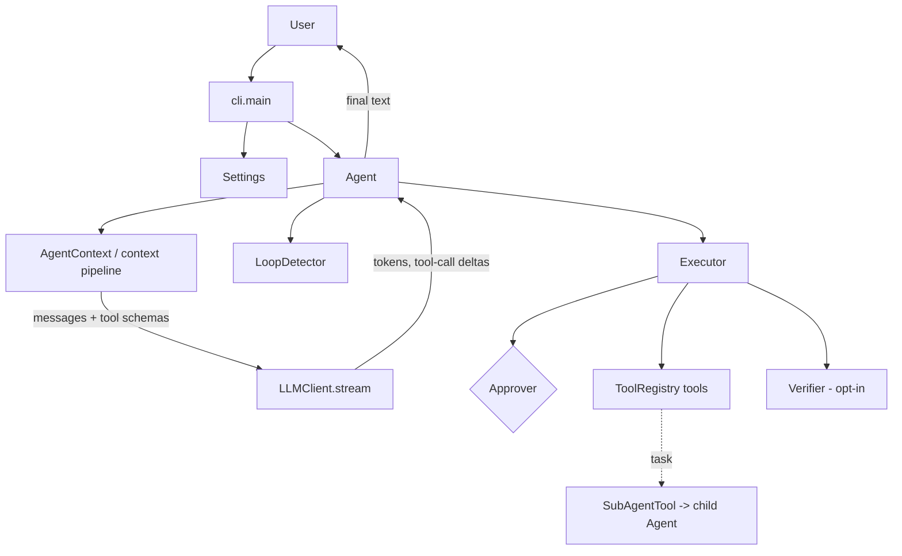

# Reflex Code v1.0 Engineering Audit

An engineering audit of the v0.1.0 release and a roadmap toward v1.0. This document is the project checkpoint for that roadmap; it does **not** claim that Reflex Code v1.0 has been released.

Terminology used throughout:

- **Implemented** — code exists and has tests.
- **Wired into runtime** — reachable from `cli.main` in normal use.
- **Live verified** — exercised manually against a real provider during release hardening.
- **Experimental / opt-in** — shipped but disabled or bounded by default.
- **Planned** — not implemented; roadmap item.

---

## 1. Current Release

- **Release:** v0.1.0 (tag `v0.1.0`, commit `3909ac2`).
- **Scope:** single-provider terminal coding agent (OpenAI-compatible / OpenRouter), interactive REPL plus one-shot mode, 8 tools, state-driven context pipeline, approval + plan mode, sub-agent delegation, evaluation harness, opt-in verification loop, experimental RLM phase.
- **Tests:** 173 passing across 21 unit test modules at tag time; packaging covered by regression checks.
- **Distribution:** built from source (`uv build`); wheel ships all twelve first-party packages. No PyPI publication.

---

## 2. What Actually Works

### Production / Working (implemented, wired into runtime, tested)

| Capability | Evidence |
|---|---|
| Agent loop: streaming, function calling, sequential tool execution | `agent/agent.py`, unit tests; live provider runs |
| Tool set: `read_file`, `write_file`, `edit_file`, `bash`, `todo_write`, `web_search`*, `web_fetch`* | `tools/`, registry wiring (* require Firecrawl key) |
| Approval system: `always`/`auto`/`never`, deny-by-default `[y/N]` | `agent/approver.py`, `test_approver.py`; live grant/denial runs |
| Plan mode: write tools blocked at the Executor | `agent/executor.py`, `test_plan_mode_status_states`; live run |
| Context pipeline: per-iteration prompt rebuild, goal/file/tool/conversation selection | `context/`, `test_context_pipeline.py`; confirmed on wire logs |
| Loop detection + execution budgets (iterations/tool calls/wall clock) | `context/loop.py`, `test_execution_budget.py`, `test_execution_optimization.py`; loop-block observed live |
| Transient LLM retries incl. mid-stream failures; per-attempt state reset | `llm/openai_client.py`, `agent/agent.py`, `test_llm_retry.py`; reproduced from a live SSL failure |
| Per-request timeout (default 120s, configurable) covering streaming gaps | `AGENT_LLM_TIMEOUT_SECONDS`, `test_llm_timeout.py`; live fast-fail verified |
| Sub-agent delegation via `task` tool: isolated child context, failure containment, depth cap of 2 | `tools/sub_agent.py`, `test_sub_agent_delegation.py`; live delegation run |
| Evaluation harness CLI with isolated workspaces and exit-code judging | `evals/`, `test_evals.py`; single-task live run |
| Packaging: wheel contains all runtime packages incl. `rlm`/`evals` | `test_packaging.py`; clean-venv install verified |

### Experimental / Opt-in

| Capability | Scope | Evidence |
|---|---|---|
| Deterministic verification loop | Active only when `AGENT_VERIFICATION_COMMAND` is set; failed check triggers one bounded repair iteration | `verification/`, `test_agent_verification.py`, `test_verification_config.py` |
| RLM pre-execution brief | One-shot prompts only, read-only tools, ≤8 tool-turns, safe degradation on error/exhaustion; no measured quality improvement yet | `rlm/controller.py`, `test_rlm_controller.py`, `test_cli_rlm_integration.py`; live wire-level run |

### Partially Implemented

- **Context selection** — keyword/path heuristics; files are hinted, never read or ranked; `active_files` unpopulated.
- **Planning** — plan mode is an execution restriction + prompt instruction; `agent/planner.py` is an unused placeholder for a structured Plan workflow.
- **Observability** — `AgentRunMetrics` records coarse counts only (no tokens, latency breakdowns, tool-error categories); `ContextEvaluator` diagnostics are not surfaced by the agent.

### Not Yet Implemented / Not Wired

- **Multi-agent coordination**: `orchestration.MultiAgentCoordinator` (Planner/Executor/Reviewer/Researcher routing) is implemented and unit-tested but **not constructed by the CLI** — it is not v0.1 runtime functionality. Product delegation uses `SubAgentTool`.
- **Terminal-Bench results**: a Terminal-Bench-2 *oracle-agent* harness-validation run (gold patches) was performed locally during development, but its bulk artifacts are not part of the repository (generated output, excluded via `.gitignore`). **No Terminal-Bench score for Reflex exists anywhere.**
- Persistent memory (planned; no module shipped), self-improvement loops, semantic retrieval.

---

## 3. Current Architecture

Runtime path (see `ARCHITECTURE.md` for the full narrative):



Composition happens once in `cli/main.py`: settings → registry → LLM client → agent. The REPL reuses one session context; `--prompt` builds a fresh one per run. `MultiAgentCoordinator` is intentionally absent from this diagram because nothing constructs it at runtime.

---

## 4. Agent Loop

Per `Agent.run(prompt, context)`:

1. Context created/reused; user message appended.
2. Per-run `Approver`, `Executor`, `LoopDetector`, `AgentRunMetrics` instantiated.
3. Up to `max_iterations` (50): budget check (wall-clock `max_execution_time_seconds` = 300s, `max_tool_calls` = 100).
4. `context.select_context(registry_tools)` → fresh `ContextSelection`.
5. `LLMClient.stream(messages, tool_schemas)` consumed; tokens printed as they arrive; tool-call deltas accumulated by index. Transient errors retried (max 2, backoff 0.5s) with full per-attempt reset; permanent errors end the run as `"Error: ..."`; timeout (120s default) behaves as transient.
6. On `finish_reason == "tool_calls"`: assistant message stored; each call checked by `LoopDetector.observe()` then dispatched through `Executor.run()` (parse JSON → resolve tool → plan-mode guard → approval gate → execute); results appended; next iteration.
7. Otherwise: if the optional verifier is configured, its command runs; failure appends a repair turn and the loop continues. Success stores the final text, marks metrics successful, returns the reply.

Multiple tool calls in one response execute sequentially; there is no scheduler.

---

## 5. Context Engineering

State-driven, rebuilt every iteration — the persisted transcript is not what the model sees:

```text
AgentContext.messages + flags
        │
        ▼
ContextState(goal, conversation_tail, recent_tool_results, plan_mode, iteration)
        │
        ▼
PromptOrchestrator
  ├─ GoalExtractor          latest user message (compacted)
  ├─ RelevantFileSelector   path-like hints from the goal (no file reads)
  ├─ ToolScheduler          RelevantToolSelector keyword match → schemas
  ├─ ConversationSelector   bounded tail (MessageWindow, 24 messages)
  └─ PromptBuilder          fresh system message + selected conversation
        │
        ▼
ContextSelection(messages, tool_schemas, goal, relevant_files, selected_tools)
```

Deliberate limitations: selection is deterministic keyword/path heuristics; `recent_tool_results` and `active_files` are underused; `ContextEvaluator` produces diagnostics but is not called by the loop.

---

## 6. Tool System

`Tool` base class (`name`, `description`, JSON-schema `parameters`, `is_read_only`) + duplicate-rejecting `ToolRegistry`. Registered in `cli/main.py`: `read_file`, `write_file`, `edit_file`, `bash`, `todo_write`, `web_search`, `web_fetch`, `task`. The model sees relevance-filtered schemas per iteration. `is_read_only` drives three behaviors consistently: auto-mode approval, plan-mode blocking, and RLM's read-only filter. All execution paths convert failures into model-visible error `ToolResult`s rather than raising.

---

## 7. Sub-Agent Delegation

```text
Parent Agent
  → Executor dispatches `task` tool call (approval applies: non-read-only)
  → SubAgentTool.run(args)
      → depth check (SUBAGENT_DEPTH vs MAX_SUBAGENT_DEPTH = 2)
      → agent_factory() → child Agent + fresh registry/context
      → SUBAGENT_DEPTH incremented for the child
      → child Agent.run(prompt) with its own tools, approver, loop detector
  → child final reply returned as ToolResult content
  → Parent continues reasoning with the result in context
```

Guarantees: context isolation (child never sees parent history), identical safety rules (same settings/approval/tools), containment (child tool/LLM/factory failures become error results, parent survives), bounded recursion (a sub-agent already at depth 2 gets a refusal result). Plan mode blocks the `task` tool itself, so delegation cannot bypass plan restrictions. `MultiAgentCoordinator` remains an unwired library API.

---

## 8. LLM Reliability

- **Transient retry path:** message-marker classification (`connection reset`, `sslerror`, `record_layer_failure`, `timeout`, `timed out`, ...); up to 2 retries with 0.5s backoff; retry counter resets per iteration.
- **Streaming failures:** normalized inside `OpenAIClient.stream()` — both request creation and stream iteration produce `LLMError`; aborted attempts leak no partial tokens/deltas into retries.
- **Timeout:** explicit SDK timeout, `AGENT_LLM_TIMEOUT_SECONDS` (default 120s), covering connect, first byte, and inter-chunk reads; timeout messages classify as transient.
- **Permanent errors:** HTTP 400/401-style failures surface once as a clean `LLMError` string with no retry.
- Known bound: the OpenAI SDK performs its own internal connection retries, so worst-case wall clock for a persistently stalled provider ≈ timeout × 9 at defaults.

---

## 9. Planning and Approval

- **Plan mode:** session flag toggled by `--plan`/`/plan`. Two enforcement layers: the prompt gains a planning instruction, and the Executor refuses non-read-only tools (including `task`). There is no structured plan object yet (`agent/planner.py` placeholder).
- **Approval:** modes `auto` (non-read-only tools prompt), `always`, `never`. Prompt shows tool name, scope, and a truncated argument summary; empty input denies; EOF/Ctrl+C deny. Denials return a "User denied" result so the agent can adapt instead of crashing.

---

## 10. Evaluation

- Harness: `python -m evals.runner [--tasks-dir] [--results-dir] [--no-approval]`; each task runs in a fresh temp workspace; judged purely by verification-command exit code; writes `results.json` with per-task records + aggregate metrics.
- Built-in suite: **15 tasks** (`evals/tasks/`). Last recorded run: **12/15 passed** (`evals/results/results.json`) — recorded before the final hardening commits, so numbers are historical, not current.
- Limitations: tiny suite, exit-code-only judging, no parallelism, no regression tracking, no statistical treatment. **No external benchmark results are claimed.** A prior Terminal-Bench-2 oracle-agent run validated the harness plumbing locally; those artifacts are not part of the repository and no Reflex benchmark result exists.

---

## 11. RLM

Implemented in `rlm/controller.py`, opt-in via `AGENT_RLM_ENABLED` (default off), active **only** for one-shot `--prompt` runs. Mechanics: filter registry to read-only tools → up to 8 tool-turns of workspace inspection → prepend the resulting brief to the task prompt. Failure/exhaustion degrades safely to the original task. Honest status: implemented and tested, but no experiment in the repository demonstrates a measurable quality improvement from the brief; on at least one live trivial task the phase exhausted its budget without producing a useful brief. It is scaffolding toward recursive/self-improving behavior, not such a system today.

---

## 12. Known Limitations

Confirmed from the repository:

1. Ruff (~58 findings) and strict mypy (~166 findings) baselines are failing; quality gates configured but not clean.
2. No automated integration/E2E suite; provider-path behavior was verified manually.
3. `MultiAgentCoordinator` unwired; planner placeholder.
4. Context selection heuristic; no semantic retrieval; `ContextEvaluator` unused by the loop.
5. Evaluation freshness/scale: 15 tasks, last run predates final commits.
6. Terminal-Bench performance of Reflex: not independently verified (repository evidence covers the oracle run only).
7. RLM experimental; one-shot scope only; benefit unproven.
8. Metrics lack token usage, latency breakdowns, tool-error categories, approval/verification outcomes.
9. Single provider client wired (`anthropic_client.py` present but unwired); `AGENT_PROVIDER` setting is inert.
10. Streamed output prints directly from the agent loop (presentation/runtime coupling).

---

## 13. v1.0 Goals

Engineering goals for v1.0:

1. **Context engineering:** semantic/retrieval-based file selection; populated `active_files`; surface `ContextEvaluator` budgets in-loop.
2. **Memory/state:** persistent cross-session project memory.
3. **Planning:** structured plan objects (plan → execute → verify → revise lifecycle) consuming `agent/planner.py`.
4. **Sub-agent coordination:** wire `MultiAgentCoordinator` or extend `SubAgentTool` with result-sharing and review passes; parallel delegation where safe.
5. **RLM/self-improvement:** measurable brief-vs-no-brief experiments; trajectory capture and analysis; iterate on the reasoning phase based on data.
6. **Evaluations:** larger task suite, richer judges (not just exit codes), regression tracking over time, freshness guarantees.
7. **External verification:** run Terminal-Bench with Reflex as the agent and publish reproducible methodology.
8. **Reliability:** integration test suite with fake providers; bounded total wall-clock accounting including SDK retries; crash-only design for unexpected exceptions.
9. **Observability:** tokens, latency phases, tool-error categories, approval/verification outcomes in metrics; optional structured logs/traces.
10. **Packaging/distribution:** PyPI publication, versioned docs, CI running pytest+ruff+mypy as gates.
11. **Documentation:** keep README/architecture synchronized with each release; ADRs for significant decisions.

---

## 14. v0.1 → v1.0 Roadmap

| Milestone | Theme | Contents |
|---|---|---|
| **v0.1** (released) | Stable baseline | Core loop, tools, approval/plan mode, delegation, reliability hardening, eval harness, packaging |
| **v0.2** | Measurement foundation | Integration test suite with fake providers; metrics expansion (tokens/latency/error categories); RLM brief-vs-baseline experiments; trajectory logging |
| **v0.3** | Evaluation + self-improvement | Larger/broader task suite, richer judges, eval regression tracking; first data-driven RLM improvements; CI quality gates (ruff/mypy baselines driven to zero) |
| **v0.4** | Orchestration | Wire coordinator or evolve sub-agents: review passes, result sharing, bounded parallelism; structured planning lifecycle |
| **v0.5** | Capability depth | Semantic context selection/retrieval; persistent project memory; verifier promoted from opt-in to recommended default flows |
| **v1.0** | Mature evaluated system | Independent external benchmark run (e.g., Terminal-Bench) with published methodology; stable extension APIs; distribution on PyPI; docs fully synchronized |

Sequencing rationale: measurement before optimization (v0.2 before v0.3), orchestration only after reliable single-agent evaluation exists (v0.4), capability depth once orchestration is stable (v0.5), and external claims only when independently verifiable (v1.0).
